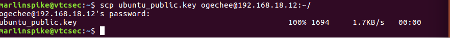

# GPG Two-Machine Encryption Lab

## Overview

After completing the single-user GPG lab, I wanted to simulate 
how two people actually communicate securely using GPG. This lab 
runs a full two-way encrypted conversation between two separate 
machines — Kali Linux and Ubuntu — connected over a local network 
in VirtualBox.

---

## Lab Environment

| Machine | OS | Role | IP |
|---|---|---|---|
| Kali | Kali Linux | Person A (sender) | 192.168.18.12 |
| Ubuntu | Ubuntu | Person B (receiver) | 192.168.18.13 |

---

## Tools Used

- Kali Linux (GPG 2.4.8)
- Ubuntu (GPG 2.1.11)
- SCP (file transfer over SSH)
- VirtualBox

---

## Lab Objectives

- Generate key pairs on two separate machines
- Exchange public keys securely over SCP
- Encrypt a message on Kali using Ubuntu's public key
- Decrypt the message on Ubuntu using Ubuntu's private key
- Encrypt a reply on Ubuntu using Kali's public key
- Decrypt the reply on Kali using Kali's private key

---

## Steps

### Step 1 — Generate Key on Ubuntu

```bash
gpg2 --full-gen-key
```

- Key type: ECC (sign and encrypt)
- Curve: Curve 25519
- Expiry: 0 (no expiry)
- Name: Ubuntu User
- Email: ubuntu@lab.com

### Step 2 — Export Ubuntu's Public Key

```bash
gpg2 --export --armor ubuntu@lab.com > ubuntu_public.key
```

### Step 3 — Send Ubuntu's Public Key to Kali

```bash
scp ubuntu_public.key ogechee@192.168.18.12:~/
```



### Step 4 — Import Ubuntu's Public Key on Kali

```bash
gpg --import ubuntu_public.key
gpg --list-keys
```

### Step 5 — Kali Encrypts a Message for Ubuntu

```bash
echo "Hey Ubuntu, this message is for your eyes only" > message_for_ubuntu.txt
gpg --encrypt --recipient ubuntu@lab.com message_for_ubuntu.txt
```


### Step 6 — Send Encrypted Message to Ubuntu

```bash
scp message_for_ubuntu.txt.gpg marlinspike@192.168.18.13:~/
```

### Step 7 — Ubuntu Decrypts the Message

```bash
gpg2 --decrypt message_for_ubuntu.txt.gpg
```


### Step 8 — Export Kali's Public Key and Send to Ubuntu

```bash
gpg --export --armor kali@lab.com > kali_rsa_public.key
scp kali_rsa_public.key marlinspike@192.168.18.13:~/
```


### Step 9 — Ubuntu Imports Kali's Key and Encrypts a Reply

```bash
gpg2 --import kali_rsa_public.key
echo "Got your message Kali, here is my reply" > reply_for_kali.txt
gpg2 --encrypt --recipient kali@lab.com reply_for_kali.txt
scp reply_for_kali.txt.gpg ogechee@192.168.18.12:~/
```

### Step 10 — Kali Decrypts the Reply

```bash
gpg --decrypt reply_for_kali.txt.gpg
```


---

## Errors and Fixes

### SSH not running on Kali
SCP failed because SSH was not active on Kali.

**Fix:**
```bash
sudo systemctl start ssh
```

## How This Works in the Real World

This lab mirrors exactly how encrypted communication works outside the lab:

- **Encrypted email** - tools like Thunderbird with Enigmail use the same public/private key model
- **Threat intelligence sharing** - security teams exchange sensitive indicators without exposing them in transit
- **Software signing** - developers sign releases with their private key so users can verify authenticity using the public key
- **File protection** - confidential files moving between systems are encrypted so only the intended recipient can open them


